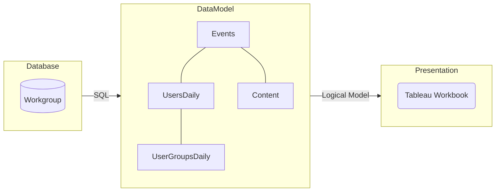

# Insight into your (Tableau) analytics!
With this Tableau companion application, Tableau Creators can learn how their applications are being used, optimise their content, and close gaps in their analytical offering.

## Introduction

Good content drives more user engagement which, in turn, drives demand for more content. A network effect for enterprise analytics.

As content creators we typically want to optimise a few things:
1. **Engagement**: We want to ensure that each tool we build gets the appropriate level of engagement (keyword _appropriate_, not all dashboards have to be viewed every day!)
2. **Penetration**: We want to ensure that every tool is embedded into the user base with all the appropriate users. People come and go, good analytical tools are forever.
3. **Debt**: We need to balance the amount of content we have with the maintence demends "data debt". 
4. **Time**: Data people never have enough time. We need empirical evidence to help us shape the roadmap and make tough priority calls.

Therefore, the idea is simple: _Think of Analytical Applications (workbooks) the same way Ebay and Amazon think about Classified Listings or LinkedIn and Instagram think about Sponsored posts._

You can view a sample application on [Tableau Public](https://www.google.co.uk). 

## Before you start

### Prerequisites
1. You will need access to your [Tableau Server metadata](https://help.tableau.com/current/server/en-us/perf_collect_server_repo.htm "Tableau Documentation"), also known as the workgroup database
2. You will need a Tableau Creator licence (and Tableau Desktop client prefered)

### Assumptions
In order to ensure consistency in analysis between Tableau content creators we **_highly_** recommend you have some light-touch governance in place:
1. Logical insight domains (such as departments or business units) should be grouped within a single top-level project folder (typically named "department name" for example)
2. For each logical insight domain you should have corresponding user groups to manage access. For example, Finance Department would have a parent folder called "Finance" user groups such as "Finance Creator" and "Finance Viewer"

## Getting Started
We recommend creating the logical data model first using the code in this repo (instructions to follow), then uploading the Tableau workbook and pointing it at the newly created datasource. This will allow you to manage the datasource independent of the workbook, create a schedule that meets your needs and publish the datasource for other users to analyse.

1. Clone this repository to a local directory
2. Create a new data source in Tableau and [connect to the workgroup database](https://help.tableau.com/current/server/en-us/perf_collect_server_repo.htm)
3. We will be using Tableau's [logical data model and NOT the physical data model](https://help.tableau.com/current/pro/desktop/en-us/datasource_datamodel.htm). Copy and paste each SQL file from the /SQL directory into a new "Custom SQL" table in the logical data model
4. Create the following relationships between the tables as follows:
- EVENTS to USERS_DAILY
- USERS_DAILY to USER_GROUPS_DAILY
- EVENTS to CONTENT
5. Publish and schedule your datasource to update. We recommend a nightly refresh - work with your Tableau Administrator to find a quiet time for this schedule to run.
6. Upload the Tableau workbook to the same server as your datasource
7. When prompted, select the uploaded datasource as the source for the application.

## Documentation

### Overview

The application follows a standard "BI" three-tier model - database, data model, presentation. For simplicity we opted to use an "ETL" vs "ELT" approach, therefore both extraction and manipulation are handled in the data model layer. This allows us to avoid the need for a staging area and orchestration tool.

#### Database Layer

The primary source for this application is the Tableau Server's metadata AKA the workgroup database. You can read more about this datasource [here](https://help.tableau.com/current/server/en-us/data_dictionary.htm "Tableau Documentation"). 

Data is extracted from the workgroup database using custom SQL to create a logical data model within Tableau "DataModel".

#### DataModel Layer

Each table in the Tableau logical data model is represented as a row on the below table, and each table/row has a SQL query in /SQL/*

| Table Name | Description | Code |
| ------ | ------ | ------ |
| EVENTS | The core fact table. A row for every **_engagement action_** taken by a user on the server | [EVENTS.SQL](SQL/EVENTS.sql) |
| CONTENT | A dimention table that links workbooks and datasources to their highest parent project folder (max. 5 nested folders) | [CONTENT.SQL](SQL/CONTENT.sql) |
| USERS_DAILY | A daily history for each user account showing what users are licenced on a given day. Only licenced users are included | [USERS_DAILY.SQL](SQL/USERS_DAILY.sql) |
| USER_GROUPS_DAILY | A daily history for user group membership showing what groups a user had on a given date | [USER_GROUPS_DAILY.SQL](SQL/USER_GROUPS_DAILY.sql) |

#### Presentation Layer

The application is built around a few core metrics across two core themes: Engagement (%), Access (#) across Users and Content. Each theme is backed by a series of views designed to give content creates a discovery path for new insights.

You can view a sample application on [Tableau Public](https://www.google.co.uk). 

##### KPI: Engagement (%)

##### KPI: Access (#)

##### Theme: Users

##### Theme: Content
