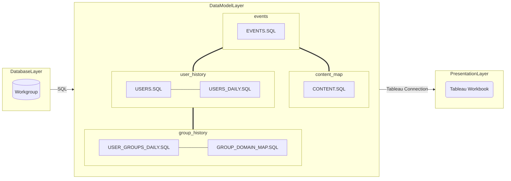

# Insight into your (Tableau) analytics!
With this Tableau companion application, Tableau Creators can learn how their applications are being used, demonstrate value to business stakeholders, optimise their content, and close gaps in their analytical offering.

## Introduction

Excellent content drives user engagement which, in turn, drives demand for more analytics content. This application helps creators understand their network effect for enterprise analytics.

The idea is simple: _**Think of Analytical Applications (workbooks) the same way Ebay and Amazon think about Classified Listings or LinkedIn and Instagram think about Content posts.**_

You can view a sample application with dummy data on [Tableau Public](https://www.google.co.uk). 

## Why

As content creators we typically try to optimise a few metrics:
1. **Engagement**: We want to ensure that each tool we build gets the appropriate level of engagement (keyword _appropriate_, not all dashboards have to be viewed every day!)
2. **Penetration**: We want to ensure that every tool is embedded into the user base with all the appropriate users. People come and go, good analytical tools are forever.
3. **Debt**: We try to balance the amount of content we have with the maintence demends "data debt". No one wants to end up cracking the handle more than innovating.
4. **Time**: Data people never have enough time. Empirical evidence helps us shape the roadmap and make tough priority calls.

## Before you start

### Assumptions
In order to ensure consistency in analysis between Tableau content and users we **_highly_** recommend you have some light-touch governance in place:
1. Logical insight domains (such as departments or business units) should be grouped within a single top-level project folder (typically named "department name" for example)
2. For each logical insight domain you should have corresponding user groups to manage access in the format "<department_name> - <role_name>". For example, Finance Department have have a parent folder called "Finance" and user groups such as "Finance - Creator" and "Finance - Viewer" 
- By matching deparment names to group names you can easily match users to content in the application later

### Prerequisites
1. You will need access to your [Tableau Server metadata](https://help.tableau.com/current/server/en-us/perf_collect_server_repo.htm "Tableau Documentation"), also known as the workgroup database
2. You will need a Tableau Creator licence (and Tableau Desktop client prefered)

## Getting Started
We recommend creating the logical data model first using the code in this repo (instructions to follow), then uploading the Tableau workbook and pointing it at the newly created datasource. This will allow you to manage the datasource independent of the workbook, create a schedule that meets your needs and publish the datasource for other users to analyse.

1. Clone this repository to a local directory
2. Create a new data source in Tableau and [connect to the workgroup database](https://help.tableau.com/current/server/en-us/perf_collect_server_repo.htm)
3. We will be using a combination of Tableau's [logical data model and physical data model](https://help.tableau.com/current/pro/desktop/en-us/datasource_datamodel.htm). There will be four logical tables. Two logical tables are made up of two physical tables. All the tables are custom SQL from ./SQL directory
4. Follow the instructions in [DataModel Layer](#DataModel-Layer)
5. Publish and schedule your datasource to update. We recommend a nightly refresh - work with your Tableau Administrator to find a quiet time for this schedule to run.
6. Upload the Tableau workbook to the same server as your datasource
7. When prompted, select the uploaded datasource as the source for the application.

## Documentation

### Overview

The application follows a typical three-layer model for data applications - database, data model, presentation. For simplicity we opted to use an "ETL" vs "ELT" approach, therefore both extraction and manipulation are handled in the data model layer. This allows us to avoid the need for a staging area and orchestration tool as Tableau handles this all.

#### Database Layer

The primary source for this application is the Tableau Server's metadata AKA the workgroup database. You can read more about this datasource [here](https://help.tableau.com/current/server/en-us/data_dictionary.htm "Tableau Documentation"). 

Data is extracted from the workgroup database using custom SQL to create a logical data model within Tableau "DataModel".

#### DataModel Layer

Each table in the Tableau data model is represented as one or more rows on the below table

| Table Name | Description | Logical Table | Code |
| ------ | ------ | ------ | ------ |
| EVENTS | The core fact table. A row for every **_engagement action_** taken by a user on the server | events | [EVENTS.SQL](SQL/EVENTS.sql) |
| CONTENT | A dimention table that links workbooks and datasources to their highest parent project folder (max. 5 nested folders) | content_map | [CONTENT.SQL](SQL/CONTENT.sql) |
| USERS | A lookup table for all current users | user_history | [USERS.SQL](SQL/USERS.sql) |
| USERS_DAILY | A daily history for each user account showing what users are licenced on a given day. Only licenced users are included | user_history | [USERS_DAILY.SQL](SQL/USERS_DAILY.sql) |
| USER_GROUPS_DAILY | A daily history for user group membership showing what groups a user had on a given date | group_history | [USER_GROUPS_DAILY.SQL](SQL/USER_GROUPS_DAILY.sql) |
| GROUP_DOMAIN_MAP | A daily history for user group membership showing what groups a user had on a given date | group_history | [USER_GROUPS_DAILY.SQL](SQL/USER_GROUPS_DAILY.sql) |

1. Import [EVENTS.SQL](SQL/EVENTS.sql) as a custom SQL query, rename the logical table "EVENTS". This logical table is now complete.
2. Import [CONTENT.SQL](SQL/CONTENT.sql) as a custom SQL query, rename the logical table "CONTENT_MAP". This logical table is now complete
3. Import [USER_GROUPS_DAILY.SQL](SQL/USER_GROUPS_DAILY.sql) as a custom SQL query, rename the logical table "GROUP_HISTORY"
	- Open the "GROUP_HISTORY" logical table created in the previous step and rename the physical table "USER_GROUPS_DAILY"
	- Add [GROUP_DOMAIN_MAP.SQL](SQL/GROUP_DOMAIN_MAP.sql) as a custom SQL query, rename this new table "GROUP_DOMAIN_MAP"
	- Specify the join type as a left join (with "USER_GROUPS_DAILY" as the left table) and the key as group_id for both tables
	- "GROUP_HISTORY" logical table is now complete
4. Import [USERS_DAILY.SQL](SQL/USERS_DAILY.sql) as a custom SQL query in the logical data model, rename the logical table "USER_HISTORY"
	- Open the "USER_HISTORY" logical table created in the previous step and rename the physical table "USER_HISTORY"
	- Add [USERS.SQL](SQL/USERS.sql) as a custom SQL query, rename this new table "USERS"
	- Specify the join type as a left join (with "USERS_HISTORY" as the left table) and the key as user_id for both tables
	- "USER_HISTORY" logical table is now complete
6. Define the relationships between each table in the logical data model as follows:
	- EVENTS to USER_HISTORY
	- USER_HISTORY to GROUP_HISTORY
	- EVENTS to CONTENT_MAP

#### Presentation Layer

The application is built around a few core metrics across two core themes: Engagement (%), Access (#) across Users and Content. Each theme is backed by a series of views designed to give content creates a discovery path for new insights.

You can view a sample application on [Tableau Public](https://www.google.co.uk). 

##### KPI: Engagement (%)

##### KPI: Access (#)

##### Theme: Users

##### Theme: Content
